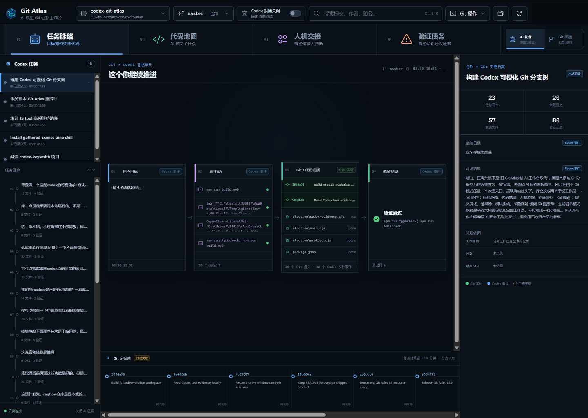
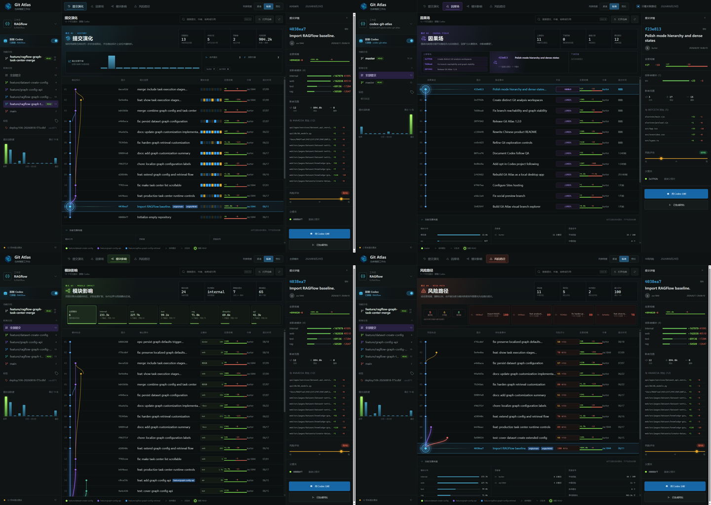
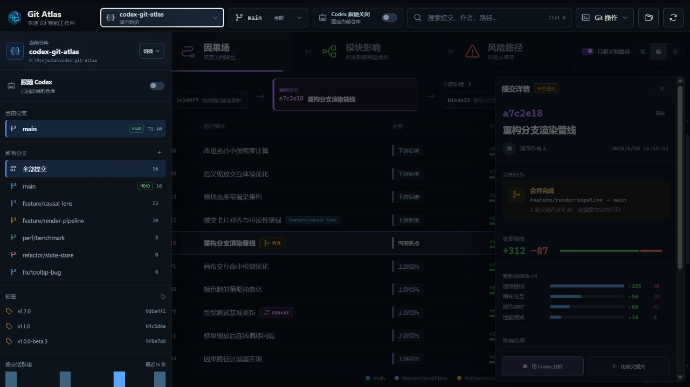
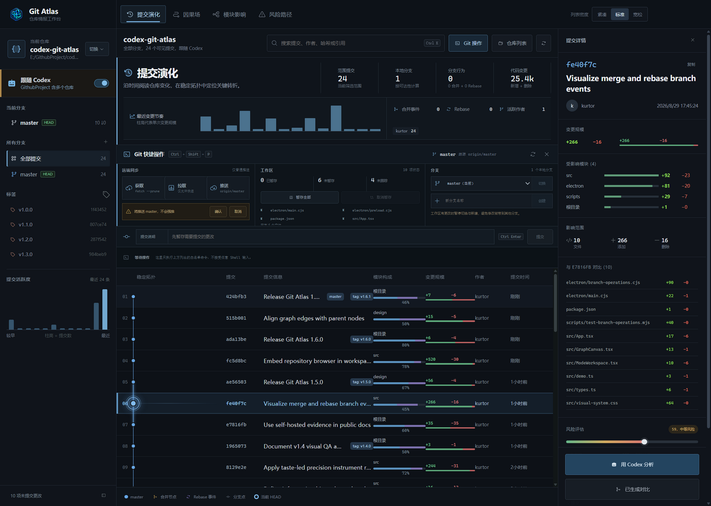

<p align="center">
  
</p>

<h1 align="center">Git Atlas</h1>

<p align="center">
  <strong>以 Git 为事实底座、以 Codex 为意图上下文的本地代码演化工作台。</strong><br>
  Git 证明真正落盘了什么，Codex 补足为什么改、尝试过什么、验证到哪里；所有证据留在本机。
</p>

<p align="center">
  <a href="https://github.com/Kurtor/codex-git-atlas/releases/latest"></a>
  
  
  <a href="LICENSE"></a>
</p>

<p align="center">
  <a href="https://github.com/Kurtor/codex-git-atlas/releases/latest"><strong>下载 Windows 便携版</strong></a>
  &nbsp;&nbsp;|&nbsp;&nbsp; <a href="#30-秒开始">30 秒开始</a>
  &nbsp;&nbsp;|&nbsp;&nbsp; <a href="#界面怎么读">界面怎么读</a>
</p>

```text
用户目标 ──▶ Codex 行动 ──▶ 文件事件 ──▶ Git 提交 / 分支 ──▶ 验证证据
  为什么          怎么做          改了什么          真正落盘什么          是否可信
```



<p align="center"><sub>任务脉络把用户目标、可见 AI 行动、Git 提交、文件事件和验证证据放进同一阅读面；底部 Git 证据带保留真实历史。</sub></p>

## 为什么需要 Git Atlas

传统 Git 分支图擅长证明“发生了什么”，却经常丢失“为什么发生”；只看 Codex 会话又会失去提交、分支、Diff 与 Merge / Rebase 这些可复现事实。Git Atlas 把两边放进同一个证据模型：AI 任务是阅读单位，Git 历史是不可替代的事实底座。

v1.9 没有推翻原来的 Git 图谱，而是在它之上增加平级的 AI 协作层。任务脉络中的文件事件会关联到真实 Git 提交；代码地图保留任务触达边界；人机交接并排展示 Codex 完成项、Git 落盘和待人判断；验证债务的每项结论都能回到命令状态或自动关联依据。顶部“AI 协作 / Git 图谱”可以随时切换，两层共享同一个仓库和历史。

| 能力 | 带来的结果 |
| --- | --- |
| 任务 × Git 证据链 | 把用户目标、Codex 可见动作、文件事件、真实提交和验证状态连成一条可追溯路径 |
| 四种 AI 工作模式 | 任务脉络、代码地图、人机交接、验证债务各有独立信息结构，不是同一张表换颜色 |
| 本机 Codex 任务读取 | 通过 Codex App Server 按需读取当前仓库任务；明确忽略 reasoning、原始 Diff 和完整命令输出 |
| Git 事实底座 | 提交、作者、时间、分支、Merge、Rebase 与变更规模始终来自本机 Git，不由模型生成 |
| 证据来源标签 | 区分 Git 实证、Codex 事件、自动关联与 AI 推断；当前版本没有证据时明确显示未知 |
| 验证债务 | 用未通过验证、缺少验证、跨模块覆盖不足和反复改写替代不可追溯的单一 AI 风险分 |
| 完整分支历史 | 使用 Git 可达性计算分支成员，不再只显示带分支标签的少数提交 |
| 稳定因果拓扑 | 节点选择只改变焦点和关系高亮，不重排节点、曲线或列表几何 |
| 分支行为锚点 | Merge 使用汇合菱形，Rebase 使用重写双环；提交行和详情同步解释来源、目标与识别依据 |
| 四种分析模式 | 提交演化、因果场、模块影响、风险路径各有专属指标、列表语义与操作区 |
| 图谱优先工作台 | 四模式拥有独立色彩与信息语法；Git 分支、Merge、Rebase、增删行使用另一套固定语义色 |
| 高密度范围档案 | 同屏聚合模块分布、贡献者、风险信号，并填补小仓库的无效空白 |
| 内嵌仓库浏览 | 在左栏直接查看最近仓库、本机目录和文件，不被系统选择弹窗打断 |
| 跟随 Codex | Codex 切换本地项目时自动切换 Git 仓库，并提供明确开关 |
| Git 快捷操作台 | 在当前页面完成获取、快进拉取、普通推送、暂存、提交和本地分支切换；命令白名单与结果回显始终可见 |
| 真实提交活跃度 | 左栏直观看到历史时间分布，点击柱形即可定位对应提交 |
| 父提交对比 | 查看真实 `git diff` 文件列表；根提交也能正确展示完整变更 |
| Codex 分析 | 通过本机 Codex CLI 只读分析提交意图、风险与建议测试 |

## 30 秒开始

1. 从 [Releases](https://github.com/Kurtor/codex-git-atlas/releases/latest) 下载 `Git-Atlas-*-Windows-x64.exe`。
2. 双击运行便携版，点击顶部仓库名称打开左侧导航；点击导航中的“切换”即可从最近仓库或本机文件列表打开 Git 仓库。
3. 如果希望它跟随 Codex，在顶部或仓库导航中显式开启“跟随 Codex”。
4. 在 AI 工作台点击“开启 AI 证据”，按需读取与当前仓库匹配的本机任务；左下角可随时关闭。

运行要求：Windows 10/11 x64，并确保 `git` 可在系统命令行中使用。AI 任务证据与“用 Codex 分析”需要已安装并登录的 Codex CLI；纯 Git 视图和 Git 操作不依赖 Codex。

## 界面怎么读

### 任务脉络

以一次 Codex 任务回合为中心，横向阅读“用户目标 → AI 行动 → Git / 代码证据 → 验证结果”。文件事件来自 Codex，提交与分支来自 Git；两者的关系若只由时间窗或工作目录推导，会明确标为“自动关联”。

### 代码地图

按任务实际触达的文件聚合模块，不显示编造的函数关系或“AI 编写占比”。当前回合文件会得到单独高亮，Git 提交仍保留在底部证据带中。

### 人机交接

三列并排展示 Codex 已完成回合、已关联的 Git 提交和等待人类判断的验证债务。Git 作者不被武断地等同于“人类修改”，没有可靠证据时保持未知。

### 验证债务

不再用一个看似精确的 AI 风险分遮蔽依据。阻断项、验证总数、通过数和逐条命令账本同屏显示；规则只使用可观察的命令、退出状态、文件触达和任务状态。

### Git 历史与操作

既有的提交演化、因果场、模块影响和风险路径完整保留为平级的“Git 图谱”工作层，仍使用大标题模式导航和完整工作区。仓库浏览、分支筛选、Merge / Rebase 事件、父提交对比和安全 Git 快捷操作的行为不变；AI 协作层是在这些事实能力之上增加的解释，而不是替代。

### 提交演化

默认工作区。按时间扫描稳定 Git DAG、提交信息、模块构成、变更规模、作者与时间；“模块构成”直接显示主要模块、占比和次要模块色段，不再使用含义不明的色块。顶部显示提交范围、分支、贡献者和代码变更总量。

### 因果场

围绕当前提交计算完整的祖先与后继集合。顶部用“上游祖先 → 当前焦点 → 下游后继”表达路径，列表中的每条提交会明确标记为上游、下游或当前焦点。“只看关联路径”会真正过滤列表，不只是降低亮度。

### 模块影响

把当前范围内的提交聚合成模块热区，按累计变更量排序，并显示触达次数和平均风险。点击模块卡片即可筛选所有触达该模块的提交，再次选择“全部模块”恢复全局。

### 风险路径

根据变更规模、删除比例、合并结构和模块跨度生成 0-100 风险评分。风险队列列出优先检查项，主列表只保留中高风险提交；详情面板同时展示四个评分因子，列表、队列与详情使用同一套规则。



<p align="center"><sub>左上为提交演化，右上为因果场，左下为模块影响，右下为风险路径。</sub></p>

### 列表密度

顶部的“紧凑 / 标准 / 宽松”只控制提交行距，不会改变数据。它取代了含义不清、难以拖动的滑块，并提供更大的点击目标与键盘焦点状态。

### 本地仓库浏览

点击顶部仓库名称会打开左侧导航，分支、标签、活跃度和工作区状态都在这里按需出现；点击导航中的“切换”后，同一抽屉原位切换为仓库浏览器。最近仓库最多保留 8 个，界面优先显示其中 3 个；下方文件列表支持逐级浏览、返回上级和直接输入路径。Git 文件夹会得到明确标记，普通文件只用于确认当前位置。手动打开仓库时会自动关闭“跟随 Codex”，避免随后被后台切回其他项目。



<p align="center"><sub>仓库浏览在左栏完成，提交拓扑和详情始终保持可见。</sub></p>

### 提交活跃度

左下角柱形图来自当前仓库的真实提交时间：横向从较早到最近，柱高代表该时间段的提交数，绿色柱代表当前选中提交所在区间。点击有数据的柱形可以快速定位。

### 跟随 Codex

此功能默认关闭。开启后，Git Atlas 会读取 Codex 当前选择的本地项目：

- 项目根目录是 Git 仓库时，直接跟随。
- 项目只包含一个直属 Git 子仓库时，跟随该仓库。
- 项目包含多个 Git 仓库时，保持当前仓库并提示歧义，不擅自猜测。
- 用户手动打开仓库或关闭开关后，停止跟随并保留当前视图。

### Merge 与 Rebase

分支的关键操作会被提升为拓扑事件，而不是淹没在普通提交里：

- Merge：从提交的多父结构稳定识别。图中使用琥珀色菱形汇合节点，提交行显示“合并”，详情区展示来源分支、目标分支与父线数量。
- Rebase：从本机 Git reflog 识别最近完成的操作。图中使用紫色双环重写节点，提交行显示 `REBASE`，详情区展示变基分支与新基线。
- 搜索框支持按 `merge`、`rebase` 和涉及的分支名定位相关提交。
- 提交演化顶部与范围档案会统计当前视图中的合并和 Rebase 事件。

Git 提交对象本身不保存 Rebase 操作记录，因此 Rebase 标记只在本机 reflog 尚未过期时可用。Git Atlas 会在详情区明确标注这一证据边界；Merge 不受此限制。

### Git 快捷操作

点击顶部“Git 操作”、左下角工作区状态，或按 `Ctrl + Shift + P`，即可在提交图上方展开操作台。它不是任意命令终端，而是一组围绕日常工作流设计的 Git 白名单：

| 区域 | 支持的操作 | 明确边界 |
| --- | --- | --- |
| 远端同步 | `fetch --prune`、`pull --ff-only`、普通 `push` | 拉取与推送需要二次确认；不提供强推 |
| 工作区 | 查看 staged / unstaged / untracked、暂存全部、取消暂存 | 取消暂存只修改索引，不丢弃工作区内容 |
| 提交 | 单行提交说明、按钮提交、`Ctrl + Enter` | 只有存在已暂存更改时才可提交 |
| 分支 | 切换已有本地分支、新建并切换分支 | 工作区不干净时暂停操作，避免把修改意外带走 |



<p align="center"><sub>操作、状态、确认和 Git 输出均留在当前工作区；图中展示普通推送的显式确认。</sub></p>

Git Atlas 不提供强制推送、硬重置、丢弃修改、删除分支或任意 Shell 输入。所有参数通过进程参数数组传给本机 Git，不经过 Shell 拼接；远端操作同时关闭终端式交互，失败原因会回显在操作台底部。

## 资源占用策略

Git Atlas 是 Electron 桌面应用，但持续工作保持克制：

- Git 历史单次最多读取 500 条提交，避免无界加载。
- 拓扑使用 Canvas 2D 绘制，数据列使用 DOM，兼顾滚动性能与文字可读性。
- 分支成员最多计算 16 个本地分支，并限制为 3 个并发 Git 进程，避免仓库打开时瞬时抢占资源。
- 模块、作者、因果关系和风险聚合均使用内存中的提交数据与 React 缓存，不增加后台扫描。
- Codex 跟随只在开关开启且窗口可见时检查；隐藏或最小化后暂停。
- Codex 状态文件按修改时间缓存，无变化时不重复解析，也不触发 React 重绘。
- 跟随检查间隔为 3 秒，仓库路径变化时才重新读取 Git 历史。
- 本机文件列表只在用户打开仓库浏览器或切换目录时读取，单次最多展示 180 项，不做后台磁盘扫描。
- AI 证据默认关闭；开启后只在首次进入、切换仓库、切换任务或手动刷新时读取，不做定时轮询。
- 每次证据读取完成后立即退出 Codex App Server，不保留额外的 Codex 常驻进程。

v1.5.0 在 Windows x64、16 逻辑处理器和真实本地仓库下的便携版实测：5 个进程合计可见空闲工作集约 377.5 MB、私有内存约 245.4 MB、5 秒整机 CPU 采样为 0%。本次分支行为功能没有增加 UI 框架、字体包或动画库，前端产物约为 286.8 KB JavaScript（gzip 86.1 KB）与 55.2 KB CSS（gzip 12.1 KB）。不同仓库规模与系统环境下会有差异，Electron 基线内存也不应被包装成“原生级轻量”。

v1.6.0 的内嵌仓库浏览同样没有新增运行依赖或常驻任务；目录访问只由用户操作触发。生产前端产物约为 308.4 KB JavaScript（gzip 91.1 KB）与 62.9 KB CSS（gzip 13.5 KB）。

v1.7.0 的 Git 快捷操作同样完全按需执行，不增加轮询、后台扫描或第三方运行依赖；操作台只在打开时读取一次工作区状态，命令完成后再刷新。生产前端产物约为 336.6 KB JavaScript（gzip 97.6 KB）与 71.6 KB CSS（gzip 15.1 KB）。

v1.8.0 将常驻左右栏改为按需抽屉与浮层，并把四层历史样式收敛为单一 token 化视觉系统。没有新增运行依赖、后台任务或动画库；生产前端产物为 336.7 KB JavaScript（gzip 97.3 KB）与 44.1 KB CSS（gzip 8.9 KB），样式体积相较 v1.7.0 下降约 38%。同一台 Windows x64 设备上，便携版空闲运行的 5 个 Electron 进程合计工作集约 401.1 MB、私有内存约 240.4 MB，5 秒 CPU 增量为 0.00 秒；内存仍主要来自 Electron 基线。

v1.9.0 加入本机 Codex 证据读取和四个 AI × Git 工作模式，没有新增前端或运行时依赖。AI 证据读取过程会短暂启动 Codex App Server，完成后立即退出；开发版空闲实测只保留 4 个 Electron 进程，5 秒 CPU 增量约 0.016 秒。生产前端产物约为 364.4 KB JavaScript（gzip 104.5 KB）与 66.3 KB CSS（gzip 13.2 KB）；不同系统缩放、GPU 驱动和仓库规模下会有差异。

## 隐私与安全

- 仓库数据通过本机 `git` 命令读取，不上传到 Git Atlas 服务。
- “跟随 Codex”只读检查本机 Codex 项目映射，不读取聊天内容。
- “AI 证据”默认关闭；开启后只读取与当前仓库工作目录匹配的任务，并只呈现用户目标、可见动作摘要、文件路径和验证状态。
- reasoning、原始 Diff 和完整命令输出会在主进程归一化时丢弃，不发送到渲染层。
- Codex 任务与 Git 提交若不是精确 SHA 匹配，会显式标注“自动关联”，不伪装成 Git 实证。
- 只有主动点击“用 Codex 分析”时，才调用已经安装并登录的本机 Codex CLI。
- Codex 分析使用临时会话与只读沙盒，并明确要求不得修改文件。
- Git 快捷操作只接受应用内置的命令与结构化参数，不提供任意 Shell；推送永不附加 `--force`，拉取固定使用 `--ff-only`。

## 本地开发

需要 Node.js 22+ 与 Git。

```bash
git clone https://github.com/Kurtor/codex-git-atlas.git
cd codex-git-atlas
npm install
npm run dev
```

常用命令：

```bash
npm run typecheck   # TypeScript 检查
npm run test:codex-evidence # 验证任务归一化、隐私过滤与验证债务规则
npm run test:git-actions # 在临时仓库验证 Git 快捷操作与安全拒绝
npm run build:web   # 构建渲染层
npm run build       # 生成 Windows 便携版到 release/
```

## 技术栈

Electron · React · TypeScript · Vite · Canvas 2D · 原生 Git CLI

## License

[MIT](LICENSE)
