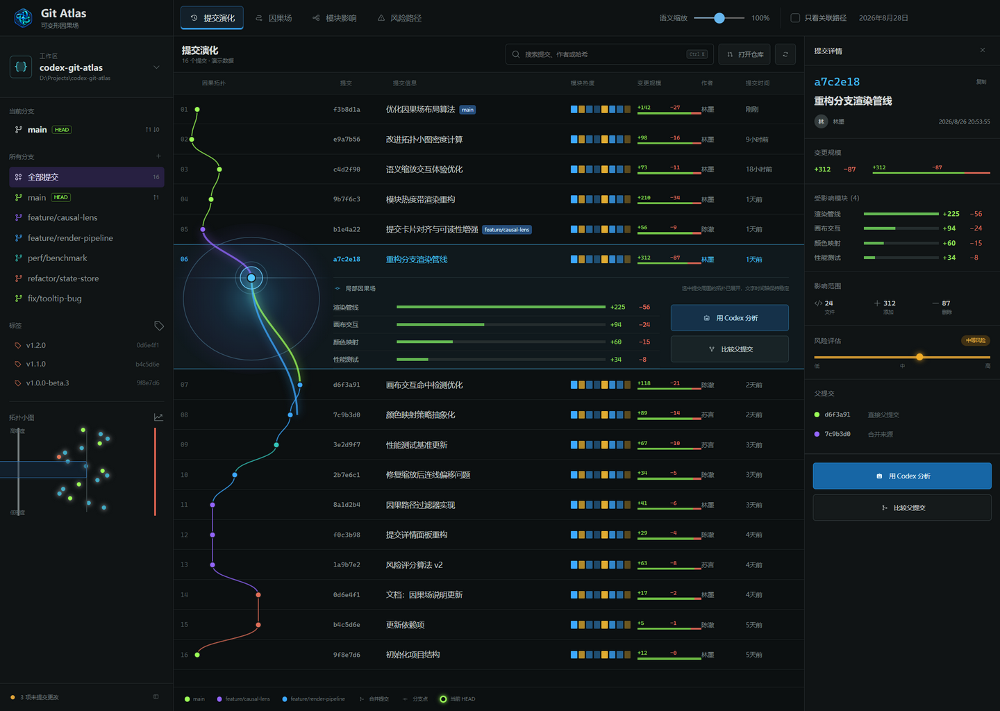

# Git Atlas

面向 Codex 工作流的本地可视化 Git 历史分析器。它使用“可变形因果场”展示提交拓扑：日常浏览保持高信息密度，选中提交时只在局部展开祖先、父提交、后续影响与模块变更。



Windows 用户可以从 [GitHub Releases](https://github.com/Kurtor/codex-git-atlas/releases) 下载便携版，双击即可运行，无需安装。

## 核心能力

- 通过系统文件夹选择器直接打开本地 Git 仓库
- 自动读取本地与远程分支、标签、提交和工作区状态
- 高密度提交时间轴与动态 Git DAG
- 局部因果场、关联路径聚焦和语义缩放
- 提交搜索、分支筛选、模块热度与增删统计
- 查看父提交、受影响文件和风险等级
- 调用本机 Codex CLI，以只读方式分析指定提交
- 全中文桌面界面，仓库内容不会上传到 Git Atlas 服务

## 本地开发

环境要求：Node.js 22+、Git，以及可选的 Codex CLI。

```bash
npm install
npm run dev
```

## 构建 Windows 应用

```bash
npm run build
```

构建完成后，可执行文件位于 `release/`。

## 隐私说明

Git Atlas 通过本机 `git` 命令读取仓库。只有当用户主动点击“用 Codex 分析”时，应用才会调用已经安装并登录的本机 Codex CLI，且使用只读沙盒分析当前提交。

## License

MIT
