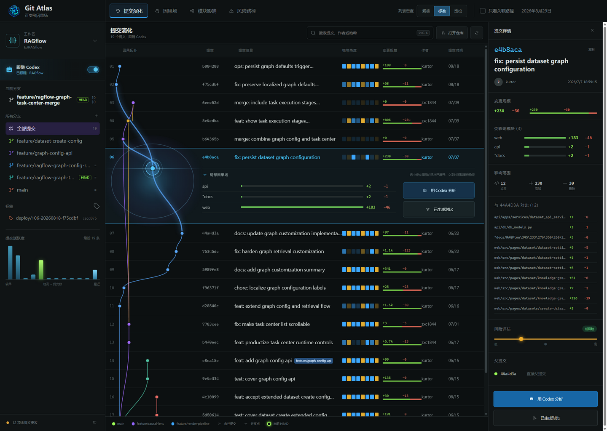

<p align="center">
  
</p>

<h1 align="center">Git Atlas</h1>

<p align="center">
  <strong>为 Codex 打造的本地 Git 因果工作台。</strong><br>
  不把历史画成一团彩色意大利面，只在你关心的提交周围展开因果关系。
</p>

<p align="center">
  <a href="https://github.com/Kurtor/codex-git-atlas/releases/latest"></a>
  
  
  <a href="LICENSE"></a>
</p>

<p align="center">
  <a href="https://github.com/Kurtor/codex-git-atlas/releases/latest"><strong>下载 Windows 便携版</strong></a>
  · <a href="#30-秒开始">30 秒开始</a>
  · <a href="#界面怎么读">界面怎么读</a>
</p>



## 为什么需要 Git Atlas

传统 Git 分支图擅长回答“线是怎么连的”，却不擅长回答开发时更常见的问题：这个提交为什么重要、改动集中在哪里、它和父提交到底差了什么，以及切换 Codex 项目后我是不是还在看正确的仓库。

Git Atlas 把这些信息压进一个高密度桌面工作台：平时保持紧凑，选中提交后才局部展开拓扑、模块影响、文件变更与风险线索。

| 能力 | 带来的结果 |
| --- | --- |
| 可变形因果场 | 选中提交附近的父子关系局部展开，文字列仍保持稳定 |
| 高密度提交视图 | 同屏扫描拓扑、提交信息、模块热度、增删规模、作者与时间 |
| 跟随 Codex | Codex 切换本地项目时自动切换 Git 仓库，并提供明确开关 |
| 真实提交活跃度 | 左栏直观看到历史时间分布，点击柱形即可定位对应提交 |
| 父提交对比 | 查看真实 `git diff` 文件列表；根提交也能正确展示完整变更 |
| Codex 分析 | 通过本机 Codex CLI 只读分析提交意图、风险与建议测试 |

## 30 秒开始

1. 从 [Releases](https://github.com/Kurtor/codex-git-atlas/releases/latest) 下载 `Git-Atlas-*-Windows-x64.exe`。
2. 双击运行便携版，点击左上角仓库卡片选择本地 Git 仓库。
3. 如果希望它跟随 Codex，在左栏显式开启“跟随 Codex”。

运行要求：Windows 10/11 x64，并确保 `git` 可在系统命令行中使用。Codex CLI 只在使用“用 Codex 分析”时需要。

## 界面怎么读

### 提交演化

默认工作区。每一行是一条提交，左侧曲线表示 Git DAG；蓝黄小格表示模块热度，绿红条表示新增与删除规模。点击提交后，局部因果场会展开该提交周围的关系与模块影响。

### 列表密度

顶部的“紧凑 / 标准 / 宽松”只控制提交行距，不会改变数据。它取代了含义不清、难以拖动的滑块，并提供更大的点击目标与键盘焦点状态。

### 提交活跃度

左下角柱形图来自当前仓库的真实提交时间：横向从较早到最近，柱高代表该时间段的提交数，绿色柱代表当前选中提交所在区间。点击有数据的柱形可以快速定位。

### 跟随 Codex

此功能默认关闭。开启后，Git Atlas 会读取 Codex 当前选择的本地项目：

- 项目根目录是 Git 仓库时，直接跟随。
- 项目只包含一个直属 Git 子仓库时，跟随该仓库。
- 项目包含多个 Git 仓库时，保持当前仓库并提示歧义，不擅自猜测。
- 用户手动打开仓库或关闭开关后，停止跟随并保留当前视图。

## 资源占用策略

Git Atlas 是 Electron 桌面应用，但持续工作保持克制：

- Git 历史单次最多读取 500 条提交，避免无界加载。
- 拓扑使用 Canvas 2D 绘制，数据列使用 DOM，兼顾滚动性能与文字可读性。
- Codex 跟随只在开关开启且窗口可见时检查；隐藏或最小化后暂停。
- Codex 状态文件按修改时间缓存，无变化时不重复解析，也不触发 React 重绘。
- 跟随检查间隔为 3 秒，仓库路径变化时才重新读取 Git 历史。

不同仓库规模与系统环境下内存会有差异。如果发现大型仓库明显卡顿，欢迎提交包含提交数量、分支数量和复现步骤的 Issue。

## 隐私与安全

- 仓库数据通过本机 `git` 命令读取，不上传到 Git Atlas 服务。
- “跟随 Codex”只读检查本机 Codex 项目映射，不读取聊天内容。
- 只有主动点击“用 Codex 分析”时，才调用已经安装并登录的本机 Codex CLI。
- Codex 分析使用临时会话与只读沙盒，并明确要求不得修改文件。

## 接下来适合补什么

优先级按“减少日常操作”排序，而不是按视觉噱头排序：

1. 工作区未提交变更视图：直接查看 staged / unstaged 文件和规模。
2. 任意两点比较：固定 A、B 两个提交后查看净变更与路径差异。
3. 提交书签与本地备注：给排查中的关键节点留下只存在本机的标记。
4. 大仓库性能模式：按需分页、关闭光晕，并显示实际渲染与 Git 读取耗时。
5. 快捷操作面板：用键盘完成打开仓库、切换分支、筛选和比较。

## 本地开发

需要 Node.js 22+ 与 Git。

```bash
git clone https://github.com/Kurtor/codex-git-atlas.git
cd codex-git-atlas
npm install
npm run dev
```

常用命令：

```bash
npm run typecheck   # TypeScript 检查
npm run build:web   # 构建渲染层
npm run build       # 生成 Windows 便携版到 release/
```

## 技术栈

Electron · React · TypeScript · Vite · Canvas 2D · 原生 Git CLI

## License

[MIT](LICENSE)
